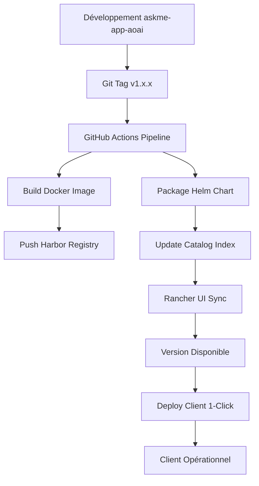

<<<<<<< HEAD
# 🚀 AskMe Rancher Catalog

Catalog Rancher officiel pour les déploiements AskMe multi-clients avec support de plusieurs providers LLM.

## 🎯 Fonctionnalités

- **🎛️ Déploiement en 1 clic** depuis l'interface Rancher
- **🏷️ Versioning Git** : Sélection de version (latest, v1.0.0, v1.1.0, etc.)
- **⚙️ Configuration par client** : Variables d'environnement personnalisables via interface web
- **🏢 Multi-tenant** : Isolation complète par namespace et client
- **✅ Production Ready** : Templates testés et validés en production
- **🤖 Multi-LLM Support** : Azure OpenAI, Claude, OpenAI Direct, Mistral, Gemini

## 🚀 Guide de Démarrage Rapide

### 1. Configurer le Catalog dans Rancher

#### Via Interface Web
1. Se connecter à Rancher : `https://jg8s67.9r1m.rancher.ovh.net`
2. **Apps & Marketplace** → **Repositories** → **Create**
3. Configuration :
   ```
   Name: askme-catalog
   Target: Git repository containing Helm chart
   Git Repo URL: https://github.com/avanteam/askme-rancher-catalog
   Git Branch: main
   ```

#### Via kubectl
```bash
kubectl apply -f rancher-catalog-setup.yaml
```

### 2. Déployer un Client
1. **Apps & Marketplace** → **Charts**
2. Rechercher **"AskMe"**
3. **Install** → Sélectionner **version** → Configurer **variables**
4. **Deploy** ✨

## 📋 Configuration Client

### Configuration Essentielle
- **Nom du Client** : `askme-principal`
- **Domaine** : `askme.avanteam-online.com`
- **Namespace** : `askme-app`

### Configuration LLM
- **Provider par défaut** : `CLAUDE`
- **Providers disponibles** : `AZURE_OPENAI,CLAUDE,OPENAI_DIRECT,MISTRAL,GEMINI`

### API Keys (sécurisées)
- **Azure OpenAI** : `Ckt6vNVrM1RMG0z0Zpz...`
- **Claude AI** : `sk-ant-api03-GUzW2wcze...`
- **Azure Search** : `cmAQfwk1UFi0CrA1nu6H...`
- **Azure CosmosDB** : `X1sw13XIqynJYeB2AY6h...`
- **Azure Speech** : `DbsYXoSVuWrPh4cB5fI6...`

### Fonctionnalités Avancées
- **Reconnaissance vocale** : Mots-clés personnalisables
- **Upload d'images** : Support multimodal
- **Historique** : Persistance CosmosDB

## 🔄 Workflow de Release Intégré

### Développement → Production
```bash
# 1. Développement dans askme-app-aoai
git checkout develop
# ... développement ...
git commit -m "feat: nouvelle fonctionnalité"

# 2. Release synchronisée
git tag v1.2.0
git push origin v1.2.0

# 3. Pipeline automatique :
# ✅ Build Docker image avec tag v1.2.0
# ✅ Package Helm chart v1.2.0
# ✅ Mise à jour catalog Rancher
# ✅ Version v1.2.0 disponible dans UI
```

### Déploiement Client
- **Interface Rancher** : Sélection de version dans dropdown
- **Configuration guidée** : Formulaire web avec tous les paramètres
- **Rolling update** : Mise à jour sans interruption
- **Rollback 1-clic** : Retour version précédente

## 🏗️ Architecture

### Structure Repository
```
askme-rancher-catalog/
├── charts/askme/               # Chart Helm principal
│   ├── Chart.yaml              # Métadonnées et version
│   ├── values.yaml             # Configuration par défaut
│   ├── questions.yaml          # Interface Rancher (formulaire)
│   ├── scripts/                # Scripts DNS OVH
│   └── templates/              # Manifestes Kubernetes
│       ├── configmap.yaml      # Configuration application
│       ├── secret.yaml         # API keys sécurisées
│       ├── deployment.yaml     # Déploiement principal
│       ├── service.yaml        # Service Kubernetes
│       ├── ingress.yaml        # Exposition HTTPS
│       └── dns-job.yaml        # Création DNS automatique
├── docs/                       # Documentation spécialisée
│   └── rancher-setup.md        # Guide configuration Rancher
├── .github/workflows/          # Pipeline CI/CD
├── index.yaml                  # Index catalog Helm
└── test-catalog.sh            # Tests automatisés
```

### Intégrations
- **Harbor Registry OVH** : Images Docker privées
- **DNS OVH** : Création automatique sous-domaines
- **Let's Encrypt** : Certificats SSL automatiques
- **Rancher RBAC** : Permissions granulaires par projet

## 🏷️ Versions et Compatibilité

| Version | Date | Features | Status |
|---------|------|----------|--------|
| **v1.0.0** | 2025-07-30 | Multi-LLM support initial | ✅ Stable |
| **v1.1.0** | TBD | RBAC + DNS automatique | 🚧 Développement |
| **latest** | Continue | Dernières fonctionnalités | ⚠️ Dev only |

## 🔧 Gestion et Maintenance

### Mise à Jour Client
1. **Installed Apps** → Sélectionner client → **Upgrade**
2. Choisir nouvelle version → Ajuster configuration → **Upgrade**

### Monitoring
- **Rancher Dashboard** : Métriques temps réel
- **Logs centralisés** : Via interface Rancher
- **Alerting** : Intégration Prometheus/Grafana

### Rollback
- **1-clic rollback** depuis interface Rancher
- **Préservation configuration** : Les settings restent intacts
- **Zero downtime** : Bascule sans interruption service

## 🛡️ Sécurité

- **API Keys** : Stockage Kubernetes Secrets (encodage base64)
- **RBAC** : Isolation par namespace et projet Rancher
- **Network Policies** : Contrôle trafic réseau
- **Image Scanning** : Vérification sécurité Harbor

## 📊 Tests et Validation

```bash
# Tests automatisés
./test-catalog.sh validate

# Tests d'intégration
./test-catalog.sh deploy test-client
```

## 🆘 Support et Documentation

- **Documentation détaillée** : [`docs/rancher-setup.md`](docs/rancher-setup.md)
- **Tests de validation** : `test-catalog.sh`
- **Repository source** : [askme-app-aoai](https://github.com/avanteam/askme-app-aoai)
- **Issues** : GitHub Issues pour rapports bugs/demandes fonctionnalités

---

## 🎯 Workflow Complet



**🚀 Déploiement AskMe simplifié : du code source au client final en quelques clics !**
=======
# 🤖 AskMe - Assistant AI Multi-Client

[](https://github.com/avanteam/askme-app-aoai/releases)
[](https://7wpjr0wh.c1.gra9.container-registry.ovh.net)
[](https://kubernetes.io)
[](./tests/)

AskMe est un assistant virtuel d'entreprise multi-client qui supporte plusieurs fournisseurs LLM et se déploie facilement via Kubernetes/Rancher.

## 🎯 Fonctionnalités

### 🧠 Multi-LLM Support
- **Azure OpenAI** - Service Azure avec intégration native
- **Claude** - Anthropic Claude 4 Sonnet pour des réponses précises
- **OpenAI Direct** - API OpenAI directe (GPT-4o)
- **Mistral** - Modèles Mistral AI open-source
- **Gemini** - Google Gemini pour la diversité des réponses

### 🏢 Architecture Multi-Client
- **Isolation complète** par namespace Kubernetes
- **Configuration personnalisée** par client via Rancher UI
- **DNS automatique** avec gestion OVH intégrée
- **Scaling indépendant** par déploiement

### 🎤 Fonctionnalités Avancées
- **Reconnaissance vocale** avec mots-clés d'activation
- **Synthèse vocale** Azure Speech Services
- **Upload d'images** avec analyse multimodale
- **Historique conversations** stocké en CosmosDB
- **Citations automatiques** depuis Azure Search

## 🚀 Démarrage Rapide

### Prérequis
- **Docker** & **Docker Compose**
- **Node.js 20+** pour le développement frontend
- **Python 3.11+** pour le backend
- **Kubernetes** cluster pour la production

### Installation Locale

```bash
# 1. Cloner le repository
git clone https://github.com/avanteam/askme-app-aoai.git
cd askme-app-aoai

# 2. Configuration
cp .env.sample .env
# Éditer .env avec vos clés API

# 3. Démarrage (build frontend + backend)
./start.sh
```

L'application sera disponible sur http://localhost:50505

### Déploiement Production

Pour déployer en production via Rancher :

```bash
# 1. Créer une version
./scripts/release-sync.sh

# 2. Déployer via Rancher UI ou CLI
./scripts/deploy-client.sh client-name domain.com
```

## ⚙️ Configuration

### Variables d'Environnement Principales

```env
# Provider LLM par défaut
LLM_PROVIDER=CLAUDE
AVAILABLE_LLM_PROVIDERS=AZURE_OPENAI,CLAUDE,OPENAI_DIRECT,MISTRAL,GEMINI

# Azure OpenAI
AZURE_OPENAI_ENDPOINT=https://your-resource.openai.azure.com
AZURE_OPENAI_KEY=your_azure_key
AZURE_OPENAI_MODEL=gpt-4o

# Claude AI
CLAUDE_API_KEY=your_claude_key
CLAUDE_MODEL=claude-sonnet-4-20250514

# OpenAI Direct
OPENAI_DIRECT_API_KEY=your_openai_key
OPENAI_DIRECT_MODEL=gpt-4o

# Azure Search (données contextuelles)
AZURE_SEARCH_SERVICE=your-search-service
AZURE_SEARCH_INDEX=your-index
AZURE_SEARCH_KEY=your_search_key
```

Voir `.env.sample` pour la configuration complète.

### Interface de Personnalisation

L'application propose une interface graphique permettant aux utilisateurs de :
- **Changer de provider LLM** en temps réel
- **Ajuster la longueur des réponses** (courtes, normales, détaillées)
- **Modifier le nombre de documents** de référence
- **Configurer la reconnaissance vocale**

## 🏗️ Architecture

### Backend (Python/Quart)
```
backend/
├── llm_providers/          # Abstraction multi-LLM
│   ├── azure_openai.py     # Provider Azure OpenAI
│   ├── claude.py           # Provider Anthropic Claude
│   ├── openai_direct.py    # Provider OpenAI Direct
│   └── ...
├── auth/                   # Authentification
├── history/                # Gestion historique
└── settings.py             # Configuration centralisée
```

### Frontend (React/TypeScript)
```
frontend/src/
├── components/
│   ├── Answer/             # Affichage des réponses
│   ├── QuestionInput/      # Interface de saisie
│   └── Customization/      # Panneau de personnalisation
├── hooks/
│   └── useVoiceRecognition.ts
└── state/                  # Gestion d'état globale
```

### Infrastructure
```
helm-chart/                 # Déploiement Kubernetes
├── templates/              # Manifestes K8s
├── values.yaml            # Configuration par défaut
└── Chart.yaml             # Métadonnées Helm
```

## 🧪 Tests

### Exécution des Tests

```bash
# Tests complets
npm test                    # Frontend
pytest                     # Backend
./scripts/test-workflow.sh  # Tests d'intégration

# Tests par catégorie
pytest tests/unit_tests/           # Tests unitaires
pytest tests/functional_tests/    # Tests fonctionnels
pytest tests/integration_tests/   # Tests d'intégration
```

### Tests E2E

```bash
# Tests End-to-End avec Playwright
cd tests/e2e
npm install
npx playwright test
```

## 🔧 Développement

### Architecture des Providers LLM

Chaque provider implémente l'interface `LLMProvider` :

```python
class LLMProvider(ABC):
    @abstractmethod
    async def send_request(self, messages: List[Dict], stream: bool = True, **kwargs):
        """Envoyer une requête au provider"""
        pass
    
    @abstractmethod  
    def format_response(self, raw_response: Any, stream: bool = True):
        """Formater la réponse en format standard"""
        pass
```

### Ajout d'un Nouveau Provider

1. Créer `backend/llm_providers/nouveau_provider.py`
2. Implémenter la classe `NouveauProvider(LLMProvider)`
3. Ajouter dans `backend/llm_providers/__init__.py`
4. Ajouter la configuration dans `backend/settings.py`

### Commandes de Développement

```bash
# Frontend
cd frontend
npm run dev                 # Serveur de développement
npm run build              # Build production
npm run lint               # Vérification code

# Backend  
python -m uvicorn app:app --port 50505 --reload
python -m pytest --cov    # Tests avec couverture
```

## 📊 Monitoring

### Surveillance des Déploiements

```bash
# Dashboard en temps réel
./scripts/monitor-clients.sh

# Status d'un client spécifique
kubectl get pods -n askme-client-name
kubectl logs deployment/askme-app -n askme-client-name
```

### Métriques Disponibles

- **Performance** : Temps de réponse LLM par provider
- **Utilisation** : Nombre de conversations par client
- **Ressources** : CPU, RAM, stockage par déploiement
- **Santé** : Status des pods et services

## 🔄 Workflow de Release

### 1. Développement
```bash
git checkout test-rg2
# ... développement ...
git commit -m "feat: nouvelle fonctionnalité"
git push origin test-rg2
```

### 2. Release
```bash
# Synchronisation des versions entre repositories
./scripts/release-sync.sh
# Choisir version (ex: v1.2.0)
# Tags automatiquement les deux repos
```

### 3. Déploiement
- **Automatique** : Pipeline CI/CD build l'image Docker et package Helm
- **Manuel** : Interface Rancher ou script CLI

### 4. Mise à Jour Client
- Sélection de version dans Rancher UI
- Rolling update sans interruption
- Rollback 1-clic en cas de problème

## 🤝 Contribution

### Standards de Code

- **Python** : PEP 8, type hints obligatoires
- **TypeScript** : Airbnb config, composants fonctionnels
- **Git** : Conventional commits, rebase workflow
- **Documentation** : Inline + README mis à jour

### Pull Request

1. Fork du repository
2. Feature branch depuis `test-rg2`
3. Tests passants requis
4. Documentation mise à jour
5. Review avant merge

## 📄 Licence

Copyright © 2025 Avanteam. Tous droits réservés.

## 🆘 Support

- **Documentation** : Voir `/docs` et guides spécialisés
- **Issues** : [GitHub Issues](https://github.com/avanteam/askme-app-aoai/issues)
- **Support** : Équipe DevOps Avanteam

---

<div align="center">

**[Rancher Catalog](https://github.com/avanteam/askme-rancher-catalog)** • **[Documentation Complète](./CLAUDE.md)** • **[Guide Workflow](./WORKFLOW_RELEASE.md)**

</div>
>>>>>>> 495d79eb27f36136c293e2922058ae9c14ef66dc
